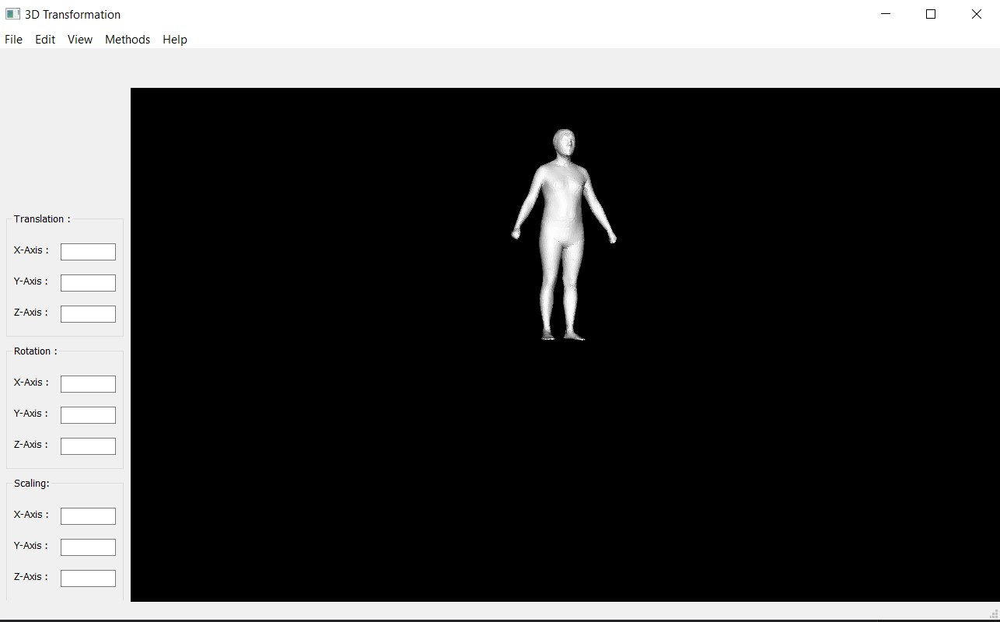

# GUI application for Rigid and Non-rigid Transformation techniques.

## **Introduction**

Implementing a GUI application for 3D Alignment/Transformation of meshes using Qt and C++.  
Aligning the 3D scans/meshes is one of the important task in statistical shape model fitting pipeline. For details regarding the alignment concepts, reader refer to my another repository called: Rigid and Non-rigid Transformation of two 3D Human full-body scans.

## Requirments
- Qt 
- VTK 8.2.0
- CMake
- MeshLab
- Visual Studio 2017

## Building
1. Install Qt VTK ( You can find here installing QtVTK: https://github.com/VelazcoJD/QtVTKTutorial)
1. Build code using CMake

## Sample GUI output

## Note:
Status of this project: under implementation 

  
